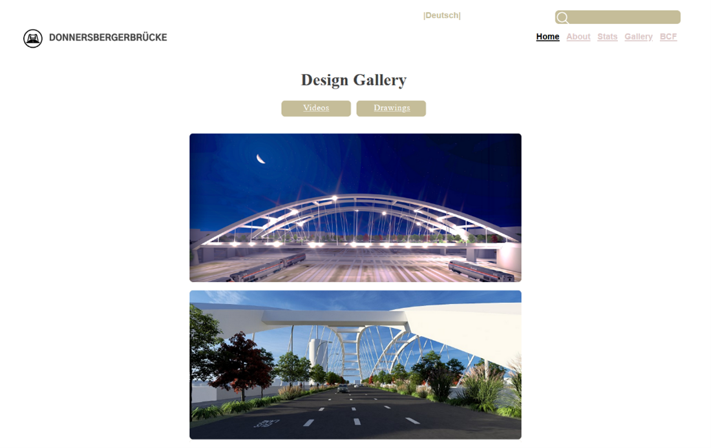
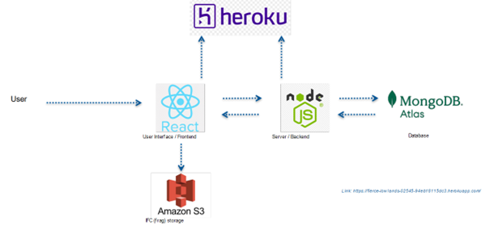
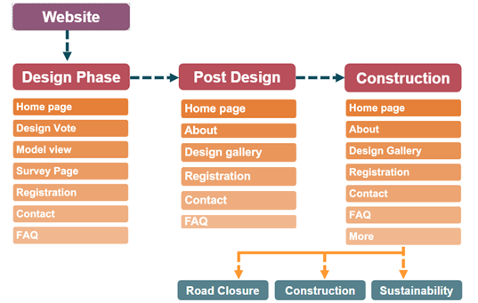
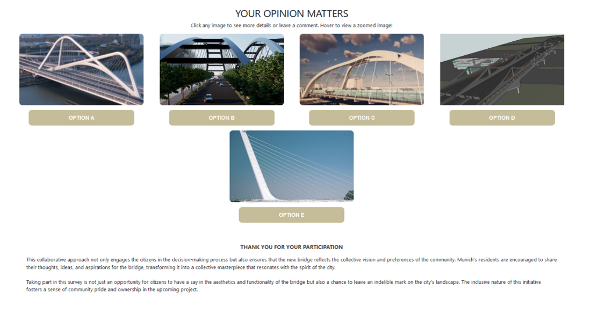

# UrbanVision 3D

**UrbanVision 3D** is a full-stack web application built with **React.js** (frontend), **Node.js** (backend), and **MongoDB** (database) for visualizing and evaluating design alternatives of the **Donnersbergerbrücke** reconstruction project in Munich. The website facilitates public engagement, feedback collection, and transparent communication throughout the project's lifecycle.

---

## Project Overview

The website provides:

- **Design Options Selection** – Users can explore and vote on multiple design alternatives.
- **Commenting and Feedback** – Visitors can give opinions on design proposals, enabling constructive public engagement.
- **Surveys and Polls** – Collect user preferences and opinions to guide project decisions.
- **Sustainability Showcase** – Highlights environmentally friendly construction measures.
- **Road Closures and Alternate Routes** – Keeps the public informed about detours during construction.
- **Photo Gallery & Videos** – Displays design images, construction updates, and as-built progress.
- **Drawings and Architectural Plans** – Access detailed schematics and blueprints.
- **FAQ Section** – Answers common questions about the bridge project.
- **User Registration** – Subscribe for notifications and project updates.
- **Contact Page** – Direct communication channel with the project team.

These features encourage transparency, community engagement, and allow stakeholders to actively participate in the bridge project.

---

## Website Structure & Architecture

### Images

- **Website Design Gallery**

*Shows design details and 3D views of the final bridge design.*

- **Frontend-Backend-DB Architecture**

*Illustrates how the frontend, backend, and database interact to deliver website functionality.*

- **Website Layout**

*Overview of website pages and content organization.*

- **Survey Page**

*Demonstrates how public surveys collect user opinions.*

---

## Technology Stack

- **Frontend:** React.js, JavaScript, HTML, CSS
- **Backend:** Node.js, Express.js
- **Database:** MongoDB
- **3D Visualization:** IFC.js, Three.js
- **Geospatial Integration:** Cesium Ion with CityGML models
- **Hosting:** Heroku

---

## Features 

| Feature | Description |
|---------|-------------|
| Design Options | Users can explore and vote on multiple design alternatives for the Donnersbergerbrücke. This allows stakeholders and the public to actively participate in the decision-making process, fostering a sense of ownership and involvement. |
| Commenting & Feedback | Visitors can provide comments and suggestions on proposed bridge designs. This encourages constructive public engagement and gives the project team valuable insights into public preferences. |
| Surveys & Polls | The website includes surveys and polls to gather opinions on various aspects of the bridge project. By participating, users help guide project priorities and provide feedback on design, accessibility, and environmental considerations. |
| Sustainability Showcase | Highlights the environmentally friendly measures incorporated in the bridge construction. Educates users about sustainable infrastructure practices and emphasizes the project's commitment to eco-conscious development. |
| Road Closures & Routes | Provides information about temporary road closures and alternate routes during construction. Helps residents and commuters plan their travel efficiently while staying informed about construction progress. |
| Photo Gallery | Displays images of proposed designs, construction updates, and completed sections of the bridge. Offers users a visual understanding of the bridge's architectural features and project development. |
| Construction Videos | Features videos documenting construction milestones from start to finish. Gives users an inside look at the building process and showcases key stages of the project. |
| Drawings & Plans | Provides access to detailed technical drawings and architectural plans of the bridge. Useful for users interested in engineering details, structural design, and architectural considerations. |
| FAQ | Answers frequently asked questions about the bridge project, including design, construction timeline, public participation, and technical aspects. Serves as a reference for stakeholders and interested citizens. |
| Registration | Allows users to register for updates, newsletters, and project notifications. Helps maintain engagement and keeps the public informed about progress and upcoming events. |
| Contact Page | Enables users to report issues, provide feedback, or ask questions directly to the project team. Facilitates open communication, accountability, and timely response to community concerns. |

---

## Key Takeaways

- Encourages **public participation** and engagement throughout the project.
- Provides **transparent information** about bridge design, construction, and sustainability.
- Adapts dynamically as the project progresses to reflect **changing priorities and requirements**.
- Combines **interactive 3D visualization**, surveys, and content management for a **full-stack web solution**.

---

